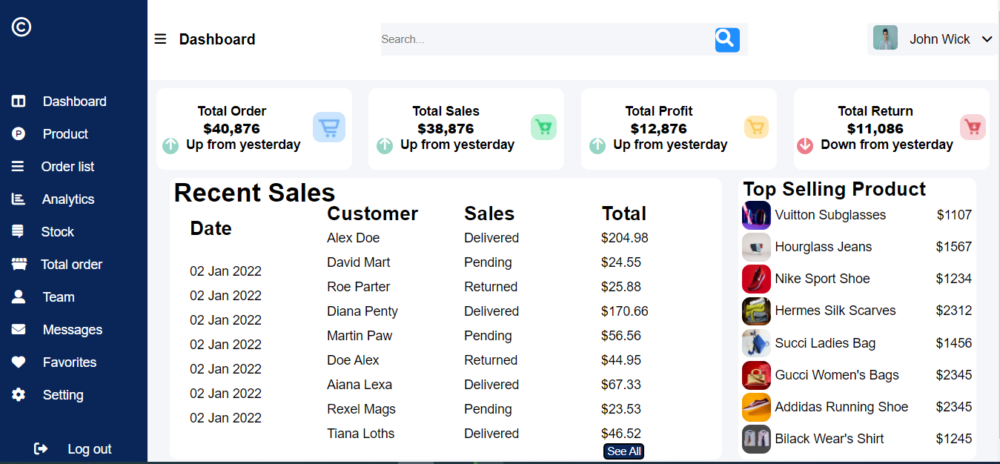

# admin__panel
 
# GITHUB INDICATORS

  # Admin__panel

Today I create with html, css and scss file for Admin__panel. I use here html, css and scss tags. 
## ## RULES OF USE

> *STEP-1:* `https://github.com/IlkinLion/admin__panel.git`  
> *STEP-2:*  enter the `Admin__panel` folder that appears  
> *STEP-3:*  open the folder you are in in a text editor  
> *STEP-4:*  run the  all the`index.html` files in the main folder  
> *STEP-5:*  to download the project as `.zip`  [here](https://github.com/IlkinLion/admin__panel/archive/refs/heads/main.zip) click  

## Technology

This project was developed using the following technologies

| No | Technique | Purpose |
| - | ---------- | --------------------- |
| 1 | HTML | Building a project skeleton |
| 2 | CSS |  Make-up of the established skeleton |
| 3 | GIT |  Project version control management |
| 4 | VSCode | Text editor used in the project |

## SAMPLE SCREEN APPEARANCE

